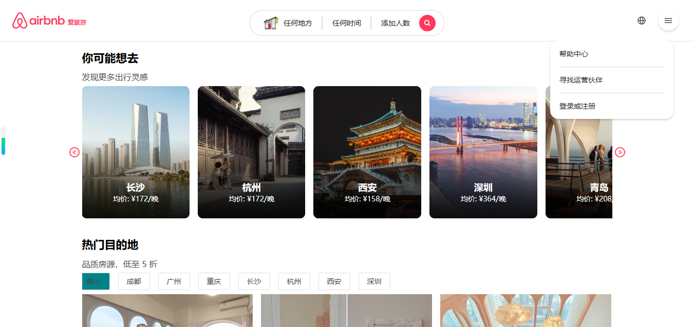
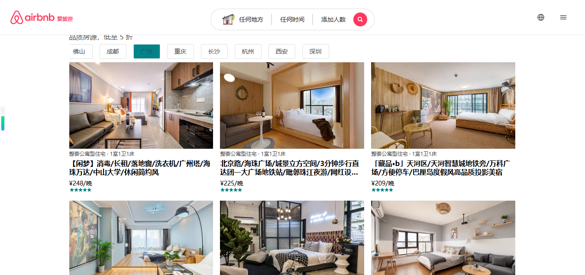
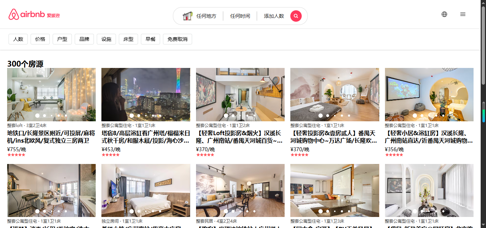
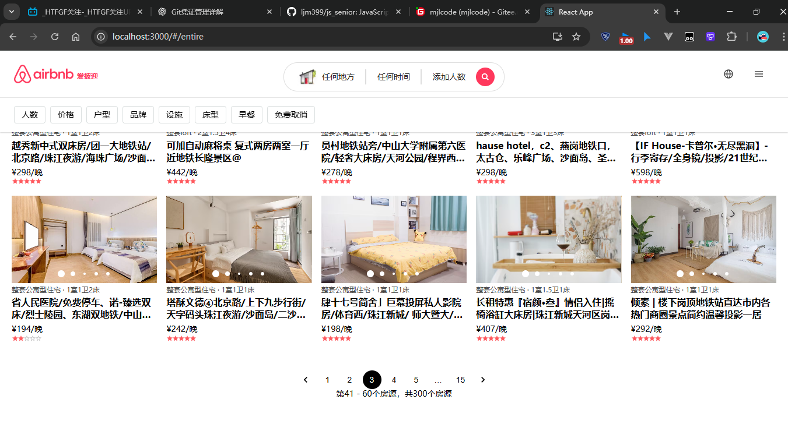
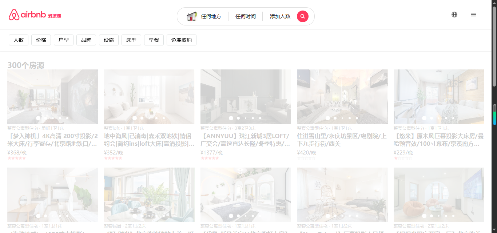
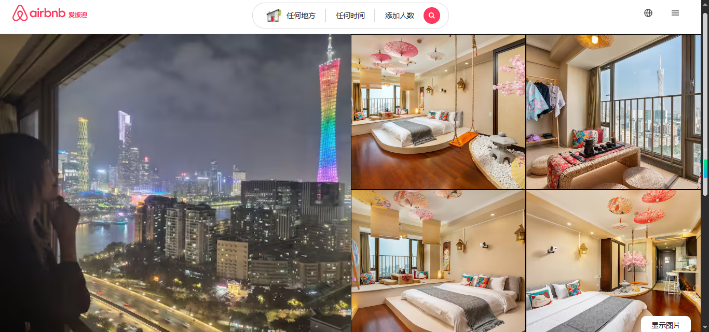
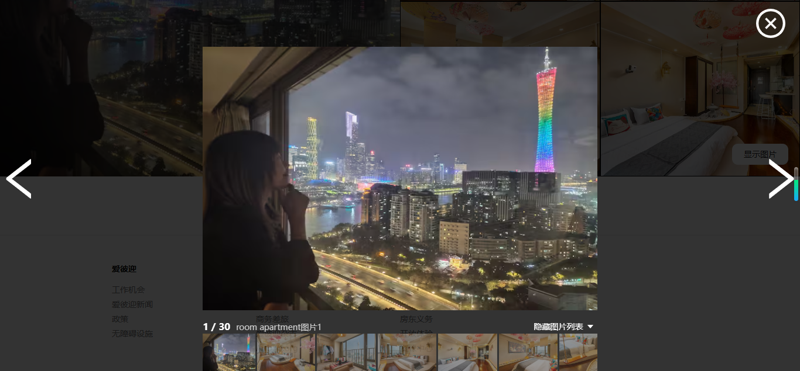

# Airbnb 房屋租赁平台

## 📖 项目简介

这是一个**基于 React 18 的 Airbnb 房屋租赁平台项目**，完整实现了房屋浏览、搜索、详情展示等核心功能。项目采用现代化的 React 技术栈，包括 Redux Toolkit 状态管理、React Router 路由、Ant Design & Material-UI 组件库，实现了高性能的单页面应用。

## 🖼️ 项目展示

### 首页部分展示

### 详情列表展示

### 详情页网络请求中

### 详情页具体房源详情展示

### 点击具体房源进入具体房源详情页

### 图片查看器

## 🛠️ 技术栈

### 核心技术

- **React 18**：现代化的前端框架，使用函数式组件 + Hooks
- **Redux Toolkit**：官方推荐的 Redux 状态管理工具
- **React Router v7**：声明式路由管理
- **Axios**：HTTP 请求库，封装网络请求
- **styled-components**：CSS-in-JS 样式解决方案

### 技术亮点

- **组件化开发**：抽离可复用的 base-ui 基础组件和业务组件
- **状态管理**：Redux Toolkit 实现全局状态管理，提升开发效率
- **UI 组件库**：Ant Design + Material-UI 双组件库结合使用
- **样式方案**：styled-components + Less 混合使用
- **工程化配置**：使用 CRACO 自定义 CRA 配置
- **代码规范**：normalize.css 统一浏览器样式
- **工具函数**：underscore 工具库提升开发效率

## 📚 优化

- ✅ React Hooks 的深入应用（useState、useEffect、自定义 Hooks）
- ✅ Redux Toolkit 现代化状态管理
- ✅ React Router v7 路由配置与导航
- ✅ Axios 网络请求封装与拦截器
- ✅ styled-components CSS-in-JS 最佳实践
- ✅ 组件化开发与代码复用
- ✅ CRACO 自定义 Webpack 配置
- ✅ 多 UI 组件库的整合应用
